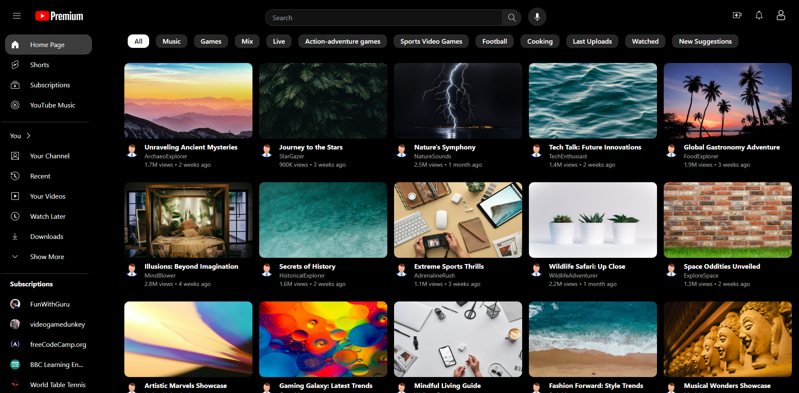

# YouTube Clone



This project is a simple YouTube clone developed using Vue.js. Tailwind CSS is utilized for styling.

## Features

- **Home Page**: Displays a list of popular videos.

## Project Setup

1. Navigate to the project folder:

    ```bash
    cd Youtube-Clone
    ```
2. Install dependencies:

    ```bash
    npm install
    ```
3. Start the project:

    ```bash
    npm run dev
    ```
4. Go to [http://localhost:5173](http://localhost:5173) in your browser to view the application.

 ## Technologies Used
- Vue.js
- Tailwind CSS

## License

This project is licensed under the MIT License. See the `LICENSE` file for more information.